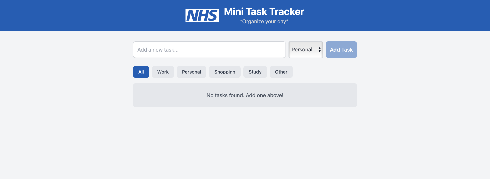

# Mini Task Tracker

*“Organise your day”*

This project is a **"Mini Task Tracker"**, a simple React application designed to help you organise your day. It allows you to quickly add and manage personal tasks, each with a title and category. You can mark tasks as complete, filter your list by category, and your tasks will be automatically saved to your browser’s local storage so you won’t lose them on your next visit.

## Preview


---

## Prerequisites

Ensure the following are successfully installed on your machine:

- **Node.js** (v21 or later)
- **npm** (v11 or later)

---

## Project Setup

1.  **Clone the repository:**
    ```bash
    git clone https://github.com/gowthamkonduri/mini-task-tracker.git
    ```
2.  **Navigate to the project directory:**
    ```bash
    cd mini-task-tracker
    ```
3.  **Install dependencies:**
    ```bash
    npm install
    ```

---

## Running the Application

To start the application in development mode, run:

```bash
npm run dev
```

Once the development server starts, Vite will display the local URL (typically http://localhost:5173) in the console. Open this link in your browser to access the application.

---

## Running Tests

To run the unit tests for the application, use the following command:

```bash
npm test
```

 The test suite uses Vitest and the React Testing Library to verify the core functionalities of the application. The tests cover adding, completing, deleting and filtering tasks.
